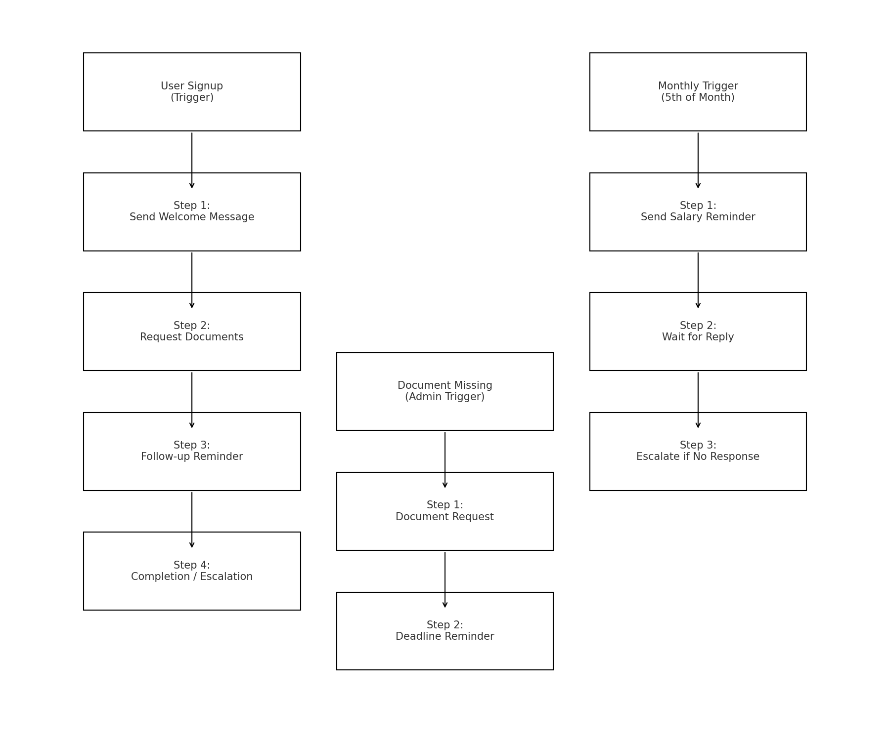
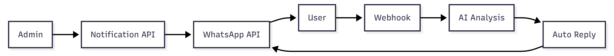
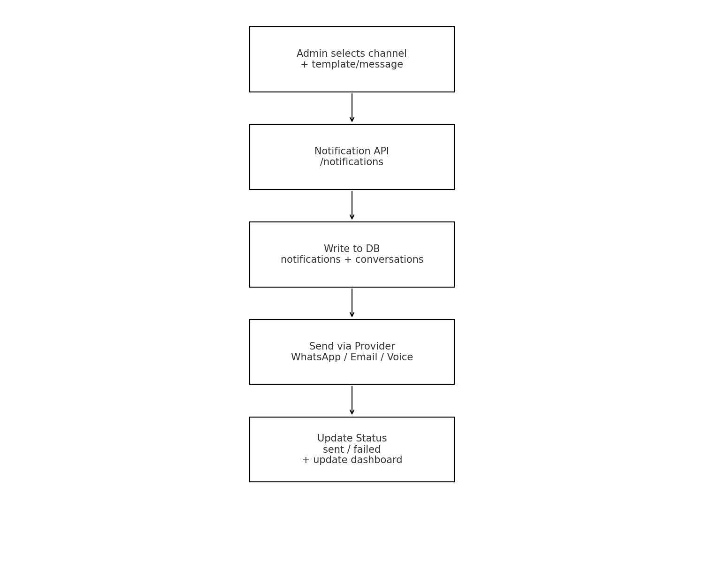

# Unified AI Command Centre - GharPey

A centralized, AI-driven communication system for managing WhatsApp, voice, and email communications with intelligent reply detection and multi-language support for Kannada, Hindi, Nepali, and English.

## Project Overview

The Unified AI Command Centre is designed to:
- Send and manage WhatsApp text/voice messages and emails
- Automatically detect intent and sentiment from user replies
- Generate intelligent auto-responses in multiple languages
- Track workflow progress through onboarding, salary reminders, and document collection
- Provide analytics and conversation management

## Tech Stack

- **Frontend**: Next.js 16 with React 19, TypeScript, Tailwind CSS
- **Backend**: Next.js API Routes
- **Database**: SQLite with better-sqlite3
- **AI/ML**: TensorFlow.js, custom NLP models for intent detection
- **Language Support**: English, Hindi, Kannada, Nepali with TTS/ASR capabilities

## Features

### 1. Admin Dashboard
- Real-time analytics and metrics
- Notification delivery trends across channels
- Workflow distribution overview
- Channel performance metrics

### 2. Notification Engine
- Send messages via WhatsApp (text & voice), Email, or SMS
- Multi-language message composition
- Pre-built message templates
- Scheduled message delivery

### 3. AI Reply Intelligence
- Automatic language detection
- Intent classification (completion, confusion, insurance queries, UPI questions, etc.)
- Sentiment analysis (positive, negative, neutral, confused)
- Auto-response generation with escalation alerts

### 4. Conversation Management
- View all incoming messages and replies
- Filter and search conversations
- AI-powered analysis tab with detected intents
- Message threading and history

### 5. Template Manager
- Create and manage message templates
- Multi-language template support
- Pre-built templates for common scenarios:
  - Welcome messages
  - Salary reminders
  - Document collection
  - Follow-up messages

## Database Schema

### Core Tables

**users**
- id, name, email, phone, role, language, status

**workflows**
- id, name, type, description, trigger_type, trigger_value, is_active

**workflow_instances**
- id, workflow_id, user_id, current_step, status, started_at, completed_at

**notifications**
- id, user_id, template_id, channel, subject, content, status, sent_at

**conversations**
- id, user_id, message_type, channel, content, language, intent, sentiment, is_audio

**templates**
- id, name, type, language, content, variables, channel

**intents**
- id, name, description, response_template, escalation_required

## Multi-Language Support

### Supported Languages
- English (en)
- Hindi (hi)
- Kannada (ka)
- Nepali (ne)

### Text-to-Speech & Speech-to-Recognition
- Outbound voice messages converted using browser Web Speech API
- Inbound voice messages transcribed using Web Speech Recognition API
- Can be integrated with Google Cloud TTS/ASR or Azure Cognitive Services

## Workflow Automation

### Pre-built Workflows

**Onboarding Flow**
1. Send welcome message
2. Request document uploads
3. Confirm receipt
4. Activate account

**Salary Reminder Flow**
1. Send salary notification
2. Wait for acknowledgment
3. Escalate if no response in 24h

**Document Collection Flow**
1. Notify missing documents
2. Send deadline reminder
3. Follow up before deadline
4. Escalate if not completed

## Installation & Setup

### Prerequisites
- Node.js 18+
- npm 

### Setup Steps

1. Install dependencies
npm install

2. Start the development server
npm run dev

3. Open the app

👉 http://localhost:3000

4. Optional: Configure environment variables

Create .env.local:

WHATSAPP_ACCESS_TOKEN=
WHATSAPP_PHONE_NUMBER_ID=
WHATSAPP_VERIFY_TOKEN=verify_token

SMTP_HOST=
SMTP_PORT=
SMTP_USER=
SMTP_PASS=
EMAIL_FROM="GharPey <no-reply@gharpey.com>"

## Usage Guide

### Sending a Notification

1. Navigate to the "Send" tab
2. Select channel (WhatsApp, Email, or Voice)
3. Enter recipient information
4. Compose message or select a template
5. Click "Send Message"

### Managing Conversations

1. Go to the "Chat" tab
2. Search for specific conversations
3. Click to view full conversation thread
4. Review AI analysis (intent, sentiment)
5. Send suggested response or customize it

### Creating Message Templates

1. Navigate to "Templates" tab
2. Click "New Template"
3. Fill in template details:
   - Name
   - Type (welcome, salary_reminder, etc.)
   - Language
   - Channel (WhatsApp, Email, Voice)
   - Content with variables like {name}, {salary_amount}
4. Click "Create Template"

### Viewing Analytics

- Dashboard shows real-time metrics
- View delivery trends across all channels
- Monitor workflow progress
- Track conversation volume and escalations

## Development Notes

### API Integration Points

All API endpoints are fully functional with SQLite backend:
- Automatic database initialization
- CRUD operations for all entities
- Analytics aggregation
- Real-time data fetching

## System & Workflow Diagrams

### 1. System Architecture

### 2. Workflow Automation

### 3. WhatsApp Inbound & Outbound Flow

### 4. Notification Sending Flow

